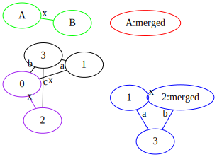
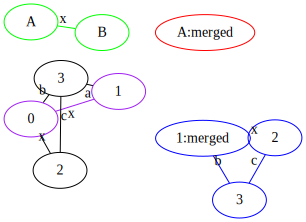

The `soffit.display` module provides a `--matches` command which:
  * Parses a left graph, a right graph, and a target graph given as command line arguments in Soffit format
  * Applies the rule defined by left=>right to the target in all possible locations
  * Displays each application as a SVG consisting of:

```
LEFT (green)        RIGHT (red)

G (black)           H (blue)
matches are purple
```

The output file is `test.N.svg'.  You may give a different file name.  At
most 20 matches are plotted currently.

## Length-7 paths through the 3x3 square lattice

```python -m soffit.display --matches "A--B--C--D--E--F--G" "A--B--C--D--E--F--G; A[start]; B[2nd]; C[3rd]; D[4th]; E[5th]; F[6t; G[end];" "X1--Y1--Z1; X2--Y2--Z2; X3--Y3--Z3; X1--X2--X3; Y1--Y2--Y3; Z1--Z2--Z3;"```


## Merging two nodes

```python -m soffit.display --matches "A--B [x]" "A^B [merged]" "M--N--O [x]; X--M; Y--N; Z--O" example-merge.svg```

 


+ two copies with the matching of A and B interchanged.

