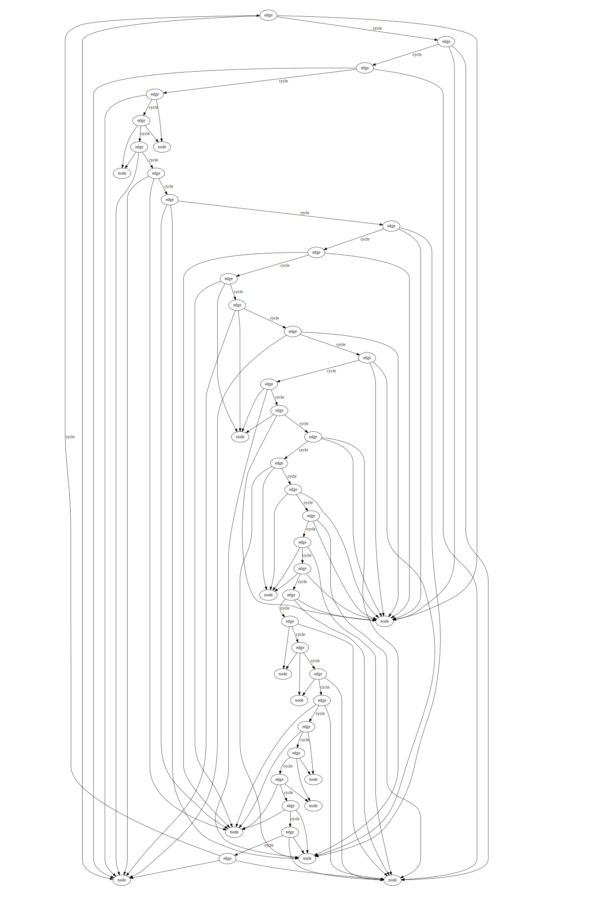

## Examples of using Soffit ##

### Building a chain of nodes ###

A simple example that just adds nodes in a line.


[source](chain.json)

### Tree ###

A branching structure, demonstrating the use of Graphviz attributes as tags.


[source](tree.json)

### Tracery ###

Translation of a [Tracery](http://tracery.io/) grammar into Soffit:


[source](tracery.json)

### Grid ###

Building a grid


[source](grid.json) -- [notes](grid.md)

### Fixed-sized binary trees ###

Demonstration of using a countdown timer to terminate the growth of the binary tree after a
given number of nodes have been added.  Three examples from the same grammar are shown.

1 | 2 | 3
---- | ---- | ----
 |  | 

[source](countdown.md)

### Rule 30 Cellular Automaton ###

This grammar creates a fixed-sized grid using the techniques from the previous two examples, then
implements a 1-d ceullar automaton on the result.

The "cursor" tag moves across the row adding one "x" at a time:

```
   eXe
  SXC

   eXe
  SXXC

   eXe
  SXXXC
```

At the end of a row, a rule caps it with an end marker and starts a new row
below the "S", if there are any "row" tags left to consume.

```
   eXe
  eXXXe
 SXC
```

This rule is illustrated below:

left graph | right graph
--- | ----
 | 

The example here has been run through three different rule sets to apply
styles to the edges (still present, but colored white so they don't show)
and to the nodes.


[source](1d-cellular-rule30.json)

[edge styling](1d-cellular-display-edges.json)

[node styling](1d-cellular-rule30-display.json)

Command line:

```
python -m soffit.application -i 3000 doc/examples/1d-cellular-rule30.json \
   doc/examples/1d-celluar-display-edges.json \
   doc/examples/1d-cellular-display.json
```

### Cyclic Generation ###

In "Procedural Generation in Game Design" (Tanya X. Short and Tarn Adams, editors), Dr. Joris Dormans gives a simple example of a set of graph generation rules on page 88 that implement a lock-and-key puzzle.

I don't have "embedded" nodes like his example shows, and instead used a
separate node for the lock and key, with tagged edges showing the relationship.


[source code](dormans-pggd.json)

### Random Pentominos ###

A pentomino can be viewed as either a chain 1-2-3-4-5 or a forked chain 1-2-3-4 3-5.  (Some shapes can be represented both ways.)  So we can generate
random pentominos on a grid by matching these two patterns with
previously-unmatched squares.  Without wildcarding, it's difficult to generate
a lot of different colors.


[source code](pentomino.json)

### Graphs with Euler Circuits ###

This rule enerates a graph and its euler circuit simultaneously.  See ["What is an example problem of an Eulerian circuit with an answer" on Quora](https://www.quora.com/What-is-an-example-problem-of-an-Eulerian-circuit-with-an-answer/answer/Mark-Gritter).

The graph is encoded with nodes tagged "node" and edges tagged "edge", so it
would require an additional set of transformations to display normally.



[source code](euler-circuit.json)

### Gists ###

These gists can be loaded directly into [Soffit's online environemnt](http://soffit.combinatorium.com/grammar).

* Generating combinatorical games: https://gist.github.com/mgritter/41d379eacdbb4527d1cee94c07c0748f
* A random walk: https://gist.github.com/mgritter/5547d191249eae4ebe2cd0e3bb6d64d6
* An exactly 101-node tree: https://gist.github.com/mgritter/8f9d68e1f8f1bf7cfec5ee618cc337fc
* A binary tree with color applied: https://gist.github.com/mgritter/7775e1a2adeef499a66dde9a88692142
* Use DPO rules to apply a guard: https://gist.github.com/mgritter/c609c9df59d3219ffa1901131d2841c2
* The Busy Beaver Turing machine with 4 states: https://gist.github.com/mgritter/15c8eef8bdcb0dfbe900c8057a74a079
* Random graph on five nodes: https://gist.github.com/mgritter/69d7be4d1d8255839201535897514ca6
