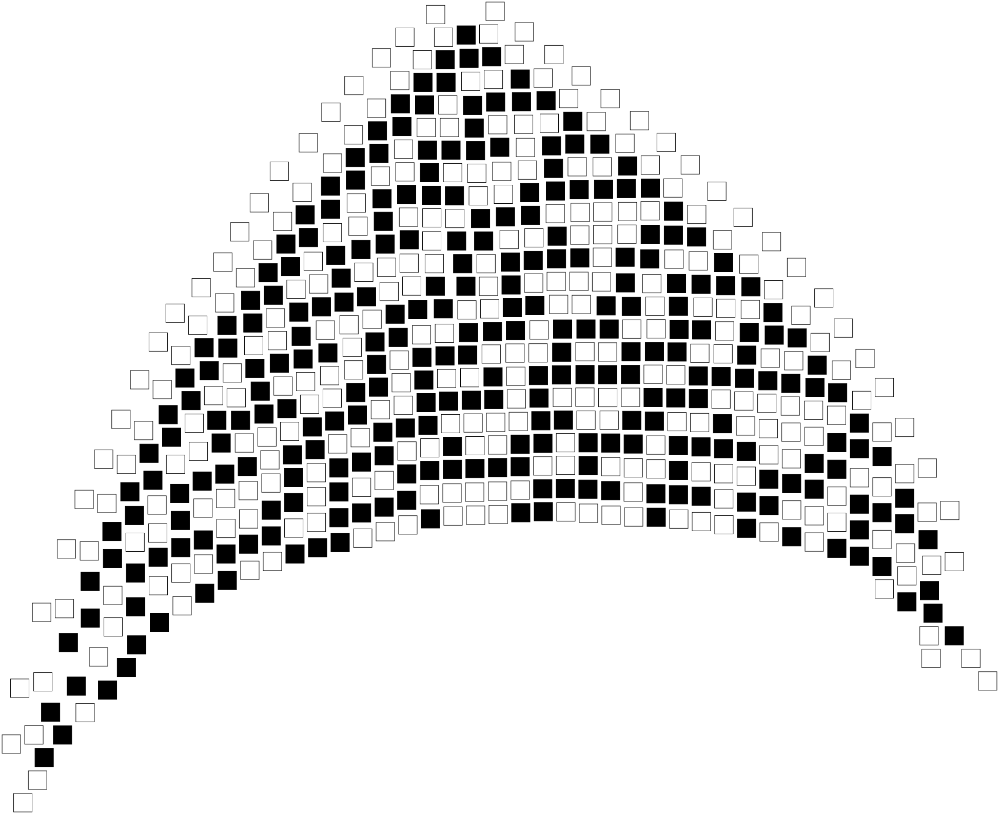

## Examples of using Soffit ##

### Building a chain of nodes ###

A simple example that just adds nodes in a line.


[source](chain.json)

### Tree ###

A branching structure, demonstrating the use of Graphviz attributes as tags.


[source](tree.json)

### Tracery ###

Translation of a [Tracery](http://tracery.io/) grammar into Soffit:


[source](tracery.json)

### Grid ###

Building a grid


[source](grid.json) -- [notes](grid.md)

### Fixed-sized binary trees ###

Demonstration of using a countdown timer to terminate the growth of the binary tree after a
given number of nodes have been added.  Three examples from the same grammar are shown.

1 | 2 | 3
---- | ---- | ----
 |  | 

[source](countdown.md)

### Rule 30 Cellular Automaton ###

This grammar creates a fixed-sized grid using the techniques from the previous two examples, then
implements a 1-d ceullar automaton on the result.

The "cursor" tag moves across the row adding one "x" at a time:

```
   eXe
  SXC

   eXe
  SXXC
  
   eXe
  SXXXC
```

At the end of a row, a rule caps it with an end marker and starts a new row
below the "S", if there are any "row" tags left to consume.

```
   eXe
  eXXXe
 SXC
```

The example has been edited to apply graphviz styles for 0 and 1, which could be done with a separate rule set.



[source](1d-cellular-rule30.json)

